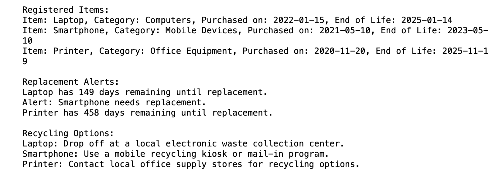

# E-waste Monitoring System

A lightweight Python tool that tracks the lifespan of electronic devices, warns you when something is due for replacement, and tells you how to recycle it responsibly.

Built around UN Sustainable Development Goal 12 (responsible consumption and production): knowing when a device reaches end-of-life is the first step to keeping it out of a landfill.

## Features

- **Item registration**: record each device with its purchase date, expected lifespan, and category.
- **End-of-life tracking**: calculates each device's end-of-life date automatically.
- **Replacement alerts**: shows the days remaining, or flags devices that are already past end-of-life.
- **Recycling guidance**: suggests the right disposal route for each category (computers, mobile devices, office equipment), with a sensible default for anything else.

## Demo



## Getting started

Requires Python 3.8+ and nothing else (standard library only).

```bash
git clone https://github.com/Charannagadeep/E-waste-Monitoring-System.git
cd E-waste-Monitoring-System/"Source code"
python main.py
```

## Usage

`main.py` registers three sample devices and prints the report. To track your own devices, use `EWasteMonitor` directly:

```python
from e_waste_monitor import EWasteMonitor

monitor = EWasteMonitor()
monitor.add_item("Laptop", "2023-03-01", 4, "Computers")
monitor.add_item("Phone", "2022-09-15", 3, "Mobile Devices")

monitor.show_items()             # registered devices + end-of-life dates
monitor.check_for_replacement()  # days remaining / replacement alerts
monitor.show_recycling_options() # disposal guidance per device
```

## Project structure

```
E-waste-Monitoring-System/
├── Source code/
│   ├── e_waste_monitor.py   # EWasteMonitor class: tracking, alerts, recycling rules
│   └── main.py              # demo entry point with sample data
└── Screenshots/
    └── output.png
```

## Roadmap

- Persist devices to a JSON or SQLite file between runs
- Interactive CLI for adding and removing devices
- Location-aware recycling center lookup
